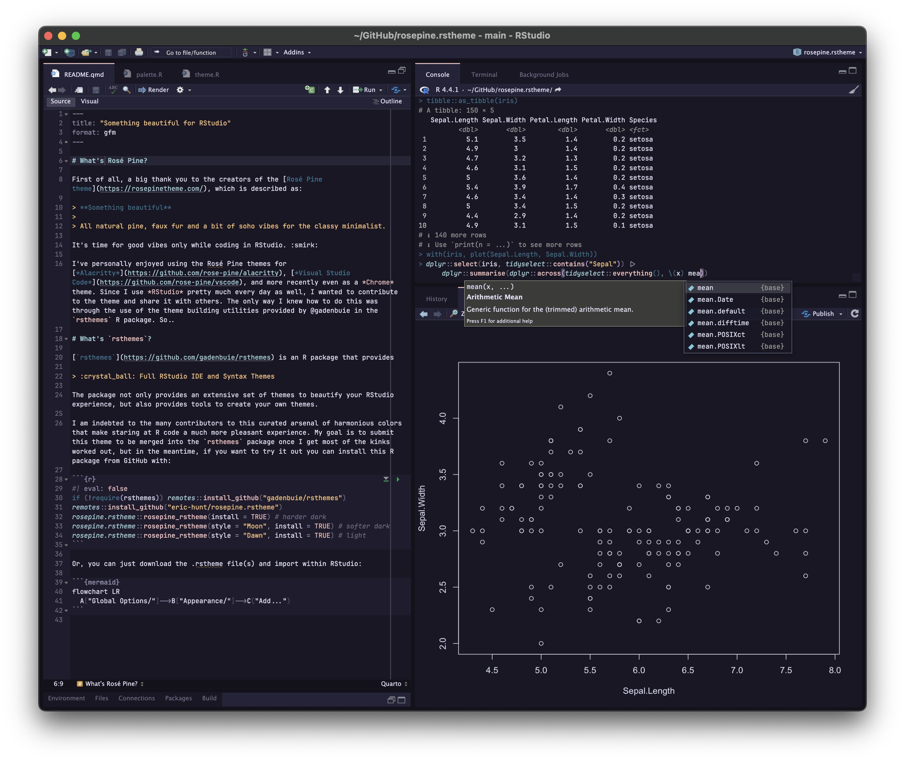
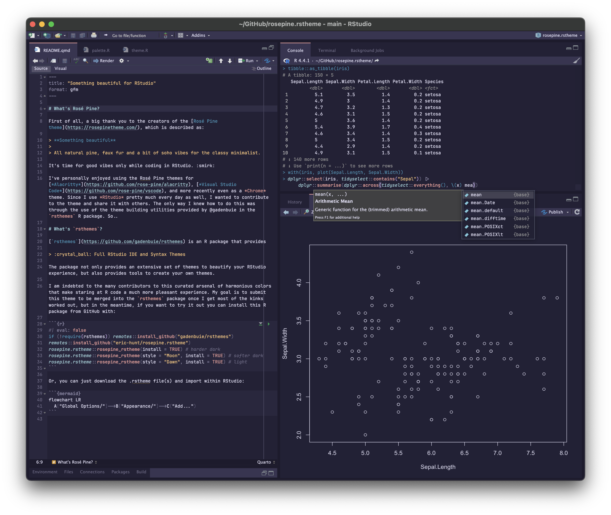
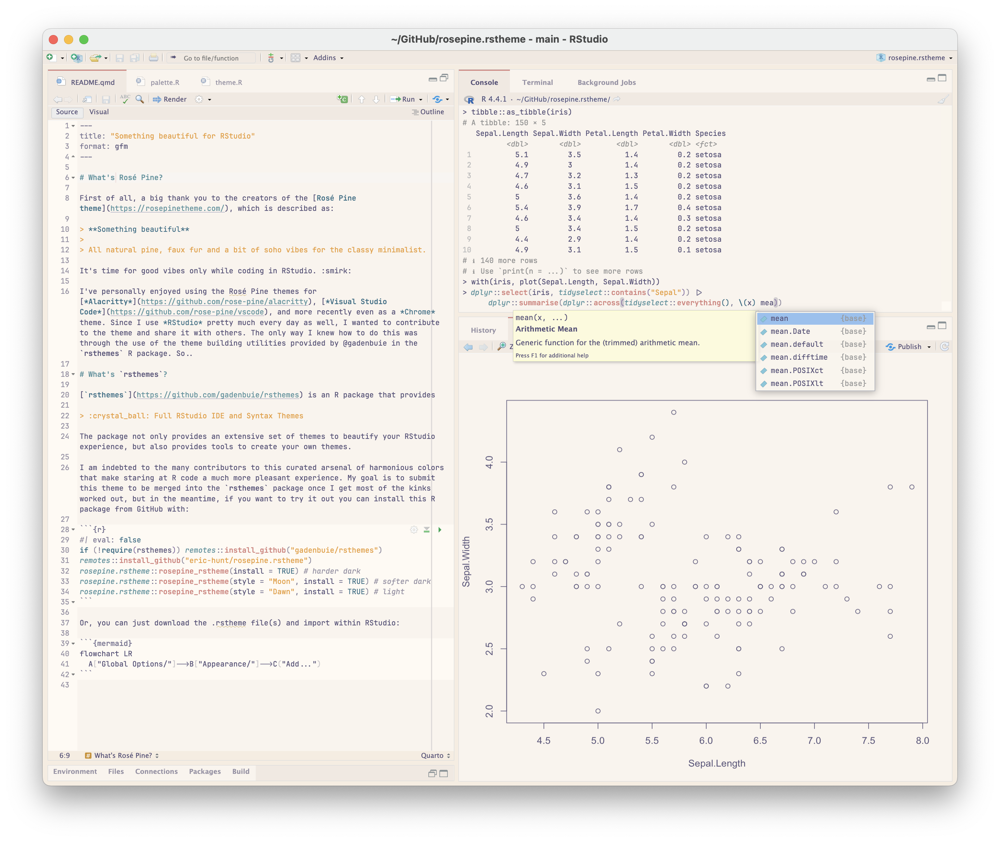
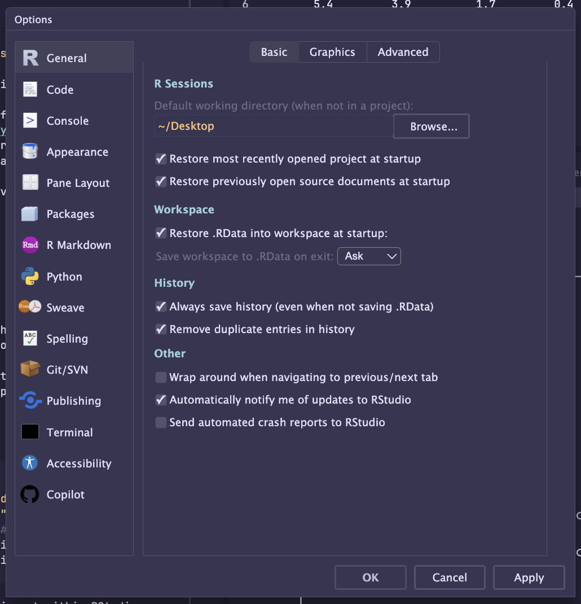
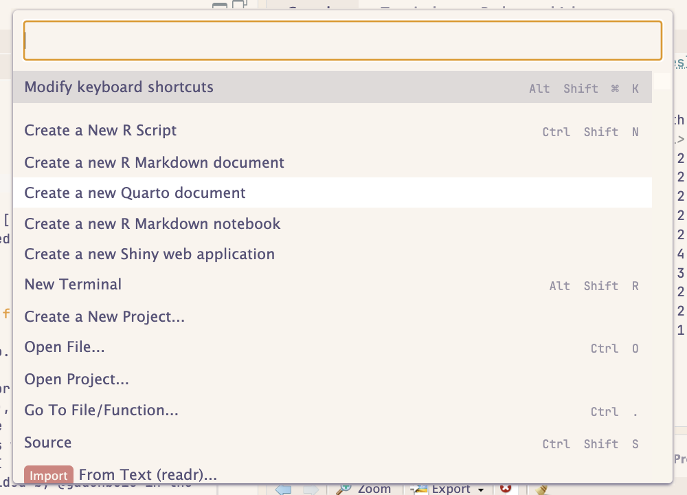
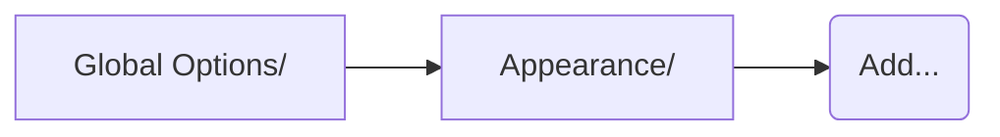

# Soho vibes for RStudio


<p align="center">

<h2 align="center">
Rosé Pine for RStudio
</h2>
</p>
<p align="center">
All natural pine, faux fur and a bit of soho vibes for the classy
minimalist
</p>
<p align="center">
<a href="https://github.com/rose-pine/rose-pine-theme">

</a>
</p>










# What’s Rosé Pine?

First of all, a big thank you to the creators of the [Rosé Pine
theme](https://rosepinetheme.com/), which is described as:

> **Something beautiful**
>
> All natural pine, faux fur and a bit of soho vibes for the classy
> minimalist.

It’s time for good vibes only while coding in RStudio. :smirk:

I’ve personally enjoyed using the Rosé Pine themes for
[*Alacritty*](https://github.com/rose-pine/alacritty), [*Visual Studio
Code*](https://github.com/rose-pine/vscode), and more recently even as a
*Chrome* theme. Since I use *RStudio* pretty much every day as well, I
wanted to contribute to the theme and share it with others. The only way
I knew how to do this was through the use of the theme building
utilities provided by @gadenbuie in the `rsthemes` R package. So..

# What’s `rsthemes`?

[`rsthemes`](https://github.com/gadenbuie/rsthemes) is an R package that
provides

> :crystal_ball: Full RStudio IDE and Syntax Themes

The package not only provides an extensive set of themes to beautify
your RStudio experience, but also provides tools to create your own
themes.

I am indebted to the many contributors to this curated arsenal of
harmonious colors that make staring at R code a much more pleasant
experience. My goal is to submit this theme to be merged into the
`rsthemes` package once I get most of the kinks worked out, but in the
meantime, if you want to try it out you can install this R package from
GitHub with:

``` r
if (!require(rsthemes)) remotes::install_github("gadenbuie/rsthemes")
remotes::install_github("eric-hunt/rosepine.rstheme")
rosepine.rstheme::rosepine_rstheme(install = TRUE) # harder dark
rosepine.rstheme::rosepine_rstheme(style = "Moon", install = TRUE) # softer dark
rosepine.rstheme::rosepine_rstheme(style = "Dawn", install = TRUE) # light
```

Or, you can just download the .rstheme file(s) and import within
RStudio:


